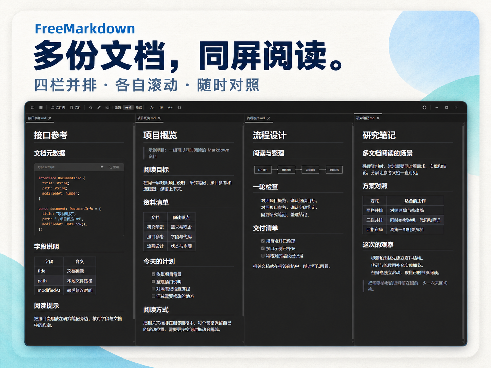
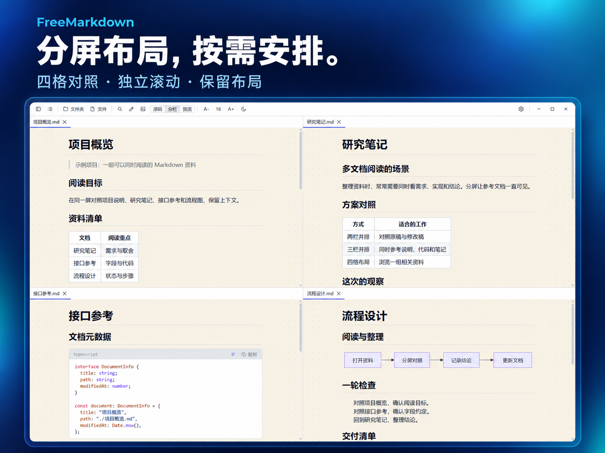
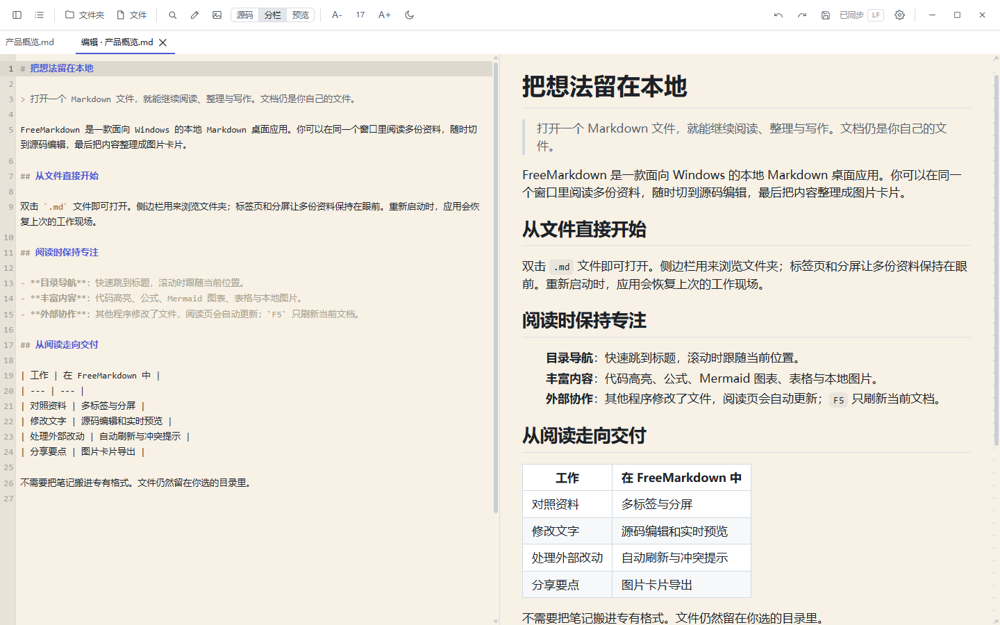
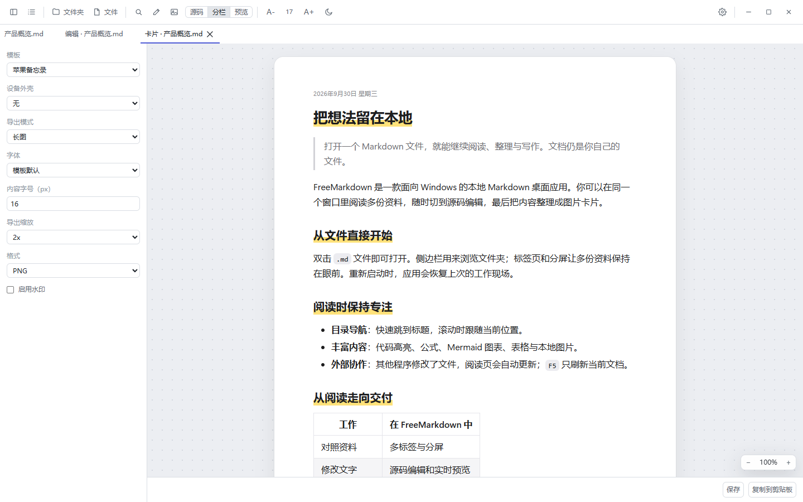

# FreeMarkdown · Windows Markdown 分屏阅读器与编辑器

[](https://github.com/PigeonAI-Yang/FreeMarkdown) [](https://github.com/PigeonAI-Yang/FreeMarkdown/forks) [](https://github.com/PigeonAI-Yang/FreeMarkdown/issues) [](#从源码运行) [](https://x.com/KimbomArtist)

[简体中文](README.md) | [English](README.en.md)
[更新日志](CHANGELOG.md)

**多份 Markdown，同屏分屏阅读。**

FreeMarkdown 是一款以多文档分屏阅读为核心的 Windows 桌面应用。把项目说明、研究笔记、接口代码和流程图放在同一屏，随时对照，减少来回切换。需要修改或分享时，也可以打开编辑器或导出图片卡片。文档仍保存在原来的文件夹中。

FreeMarkdown is a Windows Markdown reader and editor for viewing multiple local documents in split panes, with Mermaid diagrams, LaTeX math, and PNG/JPEG card export.

[功能一览](#功能一览) · [常见问题](#常见问题) · [从源码运行](#从源码运行) · [反馈问题](https://github.com/PigeonAI-Yang/FreeMarkdown/issues)

[](docs/assets/readme/split-columns.png)

## 功能一览

| 功能 | 说明 |
| --- | --- |
| 多文档分屏阅读 | 横向排列或上下组合。每个窗格独立滚动，文档位置和布局会随会话恢复。 |
| 打开本地文件 | 打开 `.md` 或 `.markdown` 文件，也可以打开文件夹并从侧边栏浏览。 |
| 编辑与保存 | 在源码、分栏和预览视图间切换。支持自动保存、`Ctrl+S` 和外部修改提示。 |
| Markdown 渲染 | 支持代码高亮、LaTeX 公式和 Mermaid 图表。 |
| 图片卡片 | 将内容导出为 PNG 或 JPEG，也可以把 PNG 复制到剪贴板。 |
| 阅读设置 | 使用目录、浅色或深色主题，并调整字号和阅读宽度。 |

## 相关资料，放在同一屏

把原稿与修改稿并排比较，或同时参考说明、代码和笔记。分屏可以横向排列，也可以上下组合；每个窗格独立滚动，并保留自己的阅读位置。应用会保存已打开的文档和布局，供下次启动时恢复。

[](docs/assets/readme/split-grid.png)

以上演示海报基于软件实机截图排版，使用示例文档。点击图片可查看原始截图。

## 打开文档，继续阅读

打开单个 `.md` 或 `.markdown` 文件，也可以打开文件夹，从侧边栏浏览其中的文档。目录、浅色与深色主题、字号和阅读宽度设置帮助你调整阅读方式。

在 Windows 中关联 Markdown 文件后，从资源管理器打开文档会交给已有的 FreeMarkdown 窗口处理。软件保持单实例运行。其他程序改动了文件时，阅读视图会更新；按 `F5` 可以手动刷新当前文档。

## 修改文字，边写边看

按 `Ctrl+Shift+E` 打开当前文档的编辑面板。你可以选择源码、分栏或预览视图。编辑器支持自动保存和 `Ctrl+S`；如果磁盘上的文件在编辑期间被其他程序修改，应用会提示你选择重新加载、覆盖或另存。



## 把内容导出为图片

按 `Ctrl+E` 打开卡片面板。选择模板和导出方式，预览排版后保存为 PNG 或 JPEG，也可以将 PNG 复制到剪贴板。



## 常用操作

| 操作 | 快捷键 |
| --- | --- |
| 打开文件 | `Ctrl+O` |
| 打开文件夹 | `Ctrl+Shift+O` |
| 搜索当前文件夹中的 Markdown 文档 | `Ctrl+Shift+F` |
| 编辑当前文档 | `Ctrl+Shift+E` |
| 打开卡片面板 | `Ctrl+E` |
| 刷新当前文档 | `F5` |

## 常见问题

### FreeMarkdown 是什么？

FreeMarkdown 是一款 Windows Markdown 阅读器与编辑器，适合把本地项目说明、研究笔记、代码和流程图并排阅读。需要修改内容时，可以切换到源码、分栏或预览视图。

### 支持哪些平台？

仓库提供 Windows NSIS 安装包构建流程。目前没有已发布的 macOS 或 Linux 安装包。

### 打开本地文档需要账号吗？

不需要云端账号。文档从本地路径打开；远程图片和链接可能需要网络连接。

### 支持哪些 Markdown 内容？

编辑器支持源码、分栏和预览视图。渲染支持代码高亮、LaTeX 公式和 Mermaid 图表，但不会执行代码块。

### 如何获取安装包？

目前 GitHub 仓库没有已发布的 Release 安装包。你可以按[从源码运行](#从源码运行)中的步骤在 Windows 上构建。

## 从源码运行

当前仓库提供源码。请先准备 Windows 开发环境、Node.js、pnpm 和 Rust；Windows 所需组件见 [Tauri 的环境准备说明](https://v2.tauri.app/start/prerequisites/)。

```powershell
git clone https://github.com/PigeonAI-Yang/FreeMarkdown.git
cd FreeMarkdown
pnpm install
pnpm tauri dev
```

构建 Windows 安装包：

```powershell
pnpm tauri build
```

安装包输出到 `src-tauri/target/release/bundle/nsis/`。`pnpm build` 只构建前端，不会生成桌面安装包。

FreeMarkdown 使用 Tauri 2、Rust、React 和 TypeScript。Markdown 渲染基于 comrak，并支持代码高亮、公式和 Mermaid 图表。
