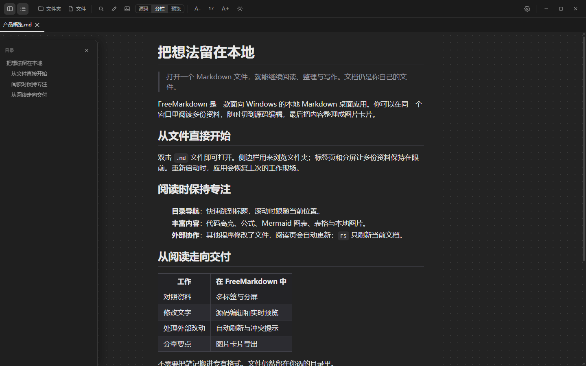

# FreeMarkdown

**打开本地 Markdown，接着读、改、导出。**

FreeMarkdown 是一款面向 Windows 的桌面应用。你可以在同一个窗口里阅读多份文档，切换到源码编辑并实时预览，再把内容导出为图片卡片。文档仍保存在原来的文件夹中。


## 打开文档，继续阅读

打开单个 `.md` 或 `.markdown` 文件，也可以打开文件夹，从侧边栏浏览其中的文档。标签页和分屏适合对照资料；目录、浅色与深色主题、字号和阅读宽度设置帮助你调整阅读方式。应用会保存已打开的文档和布局，供下次启动时恢复。



在 Windows 中关联 Markdown 文件后，从资源管理器打开文档会交给已有的 FreeMarkdown 窗口处理。软件保持单实例运行。其他程序改动了文件时，阅读视图会更新；按 `F5` 可以手动刷新当前文档。

## 修改文字，边写边看

按 `Ctrl+Shift+E` 打开当前文档的编辑面板。你可以选择源码、分栏或预览视图。编辑器支持自动保存和 `Ctrl+S`；如果磁盘上的文件在编辑期间被其他程序修改，应用会提示你选择重新加载、覆盖或另存。


## 把内容导出为图片

按 `Ctrl+E` 打开卡片面板。选择模板和导出方式，预览排版后保存为 PNG 或 JPEG，也可以将 PNG 复制到剪贴板。


## 常用操作

| 操作 | 快捷键 |
| --- | --- |
| 打开文件 | `Ctrl+O` |
| 打开文件夹 | `Ctrl+Shift+O` |
| 搜索当前文件夹中的 Markdown 文档 | `Ctrl+Shift+F` |
| 编辑当前文档 | `Ctrl+Shift+E` |
| 打开卡片面板 | `Ctrl+E` |
| 刷新当前文档 | `F5` |

## 从源码运行

当前仓库提供源码。请先准备 Windows 开发环境、Node.js、pnpm 和 Rust；Windows 所需组件见 [Tauri 的环境准备说明](https://v2.tauri.app/start/prerequisites/)。

```powershell
git clone https://github.com/PigeonAI-Yang/FreeMarkdown.git
cd FreeMarkdown
pnpm install
pnpm tauri dev
```

构建 Windows 安装包：

```powershell
pnpm tauri build
```

安装包输出到 `src-tauri/target/release/bundle/nsis/`。`pnpm build` 只构建前端，不会生成桌面安装包。

FreeMarkdown 使用 Tauri 2、Rust、React 和 TypeScript。Markdown 渲染基于 comrak，并支持代码高亮、公式和 Mermaid 图表。
