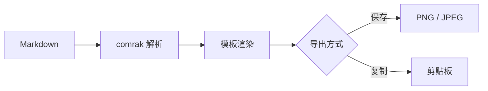

# 卡片导出验证样例

这是一份用于验证「Markdown 转图片卡片」全部渲染要素的样例文档：包含**加粗**、*斜体*、`行内代码`、[链接](https://example.com)、图片、代码块、数学公式与 Mermaid 图表。

## 基础排版

普通段落：卡片导出功能将当前文档渲染为精心设计的样式模板，支持单张长图与自动拆分多卡两种模式，可保存为 PNG/JPEG 或复制到剪贴板。

> 引用块：设计感来自排版细节——字重、行高、间距与色彩的层次。

| 功能 | 状态 | 说明 |
| ---- | ---- | ---- |
| 单长图 | 完成 | 整篇文档一张图 |
| 拆多卡 | 完成 | 按高度预算切分 |
| 剪贴板 | 完成 | PNG 直写 |

## 代码块

```rust
fn main() {
    let cards = vec!["apple-notes", "xhs-knowledge", "terminal"];
    for (i, name) in cards.iter().enumerate() {
        println!("模板 {}: {}", i + 1, name);
    }
}
```

## 数学公式

行内公式：质能方程 $E = mc^2$ 与勾股定理 $a^2 + b^2 = c^2$。

行间公式：

$$
\int_{0}^{\infty} e^{-x^2} \, dx = \frac{\sqrt{\pi}}{2}
$$

## Mermaid 图表



## 本地图片


## 长列表（拆卡压力）

1. 苹果备忘录模板：白底、黄色标题高亮带、日期页眉
2. 小红书知识卡：3:4 竖版、大标题、页码页脚
3. 公众号文章：衬线字体、米白底、微信蓝链接
4. 终端：深色底、等宽字体、绿色强调
5. 极简纸：纯白、大边距、细分隔线
6. 靛紫海报：深色渐变、白色正文
7. 复古纸张：米黄横纹、深棕衬线
8. Notion 简约：黑白灰、冷灰代码底
9. 设备外壳：iPhone 灵动岛边框
10. 设备外壳：macOS 窗口条
11. 水印：四角与居中定位
12. 字体：系统字体枚举选择
13. 字体：自定义 ttf/otf 导入
14. 缩放：1x / 2x / 3x
15. 格式：PNG 无损
16. 格式：JPEG 有损可调质量

> 拆卡规则：标题不孤行；代码块、图片、表格不跨卡切割；超出预算的大块独占一卡。

## 嵌套结构

- 第一层
  - 第二层细节
    - 第三层细节
- 回到第一层

---

## 收尾

以上内容在 900px 高度预算下应拆分为至少 3 张卡片。每一张都应保持模板的页眉页脚与背景完整性。

**验证要点**：尺寸正确、四类增强元素渲染完整、断页规则生效。
