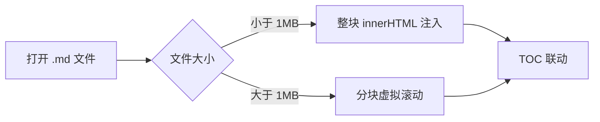
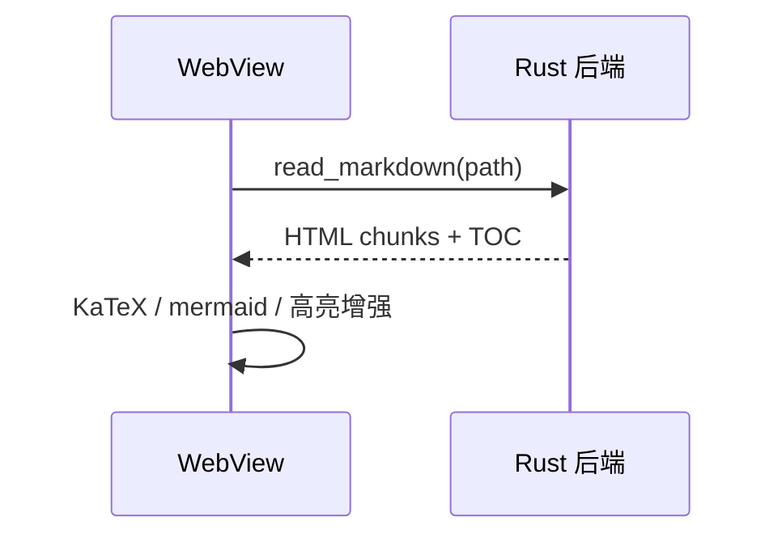
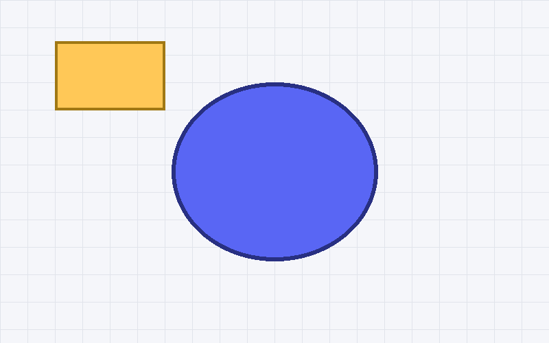

# FreeMarkdown 验收样例

> 这份文档用于验证阅读器的各项渲染能力：标题层级、代码高亮、公式、图表、表格、任务列表、删除线、脚注、图片与链接。

## 目录联动的二级标题

正文限宽 **72ch**，字号可在工具栏调整。这一段用于检查中文排版与中英文混排间距：FreeMarkdown 是一个本地 Markdown 阅读器，使用 Rust 的 comrak 在后台线程解析，WebView 只负责注入 HTML。

### 三级标题：代码块

Rust 代码高亮：

```rust
fn main() {
    let reader = MarkdownReader::new("示例.md");
    for line in reader.lines() {
        println!("{line}");
    }
}
```

TypeScript 代码高亮：

```typescript
export function fib(n: number): number {
  return n < 2 ? n : fib(n - 1) + fib(n - 2);
}
```

无语言代码块（应保持等宽字体显示）：

```
plain text block
```

### 三级标题：数学公式

行内公式：质能方程 $E = mc^2$ 与欧拉公式 $e^{i\pi} + 1 = 0$。

显示公式（高斯积分）：

$$
\int_{-\infty}^{\infty} e^{-x^2}\,dx = \sqrt{\pi}
$$

多行对齐：

$$
\begin{aligned}
(a+b)^2 &= a^2 + 2ab + b^2 \\
(a-b)^2 &= a^2 - 2ab + b^2
\end{aligned}
$$

### 三级标题：mermaid 图表

流程图：



时序图：



## 表格与列表

| 特性 | 支持情况 | 说明 |
| ---- | :----: | ---- |
| GFM 表格 | ✅ | 对齐语法 |
| 任务列表 | ✅ | 见下方 |
| 脚注 | ✅ | 见文末 |
| 公式 | ✅ | KaTeX 渲染 |
| 图表 | ✅ | mermaid 渲染 |

- [x] 打开并渲染单个 Markdown
- [x] TOC 点击跳转与滚动联动
- [ ] 待办事项样式检查
- [ ] 更多待办

嵌套列表：

1. 有序列表项
   - 无序嵌套
   - 第二个嵌套项
2. 第二项
3. 第三项

## 行内元素

**加粗**、*斜体*、~~删除线~~、`行内代码`、[外部链接](https://github.com) 以及自动链接 https://example.com 。

## 引用与分隔线

> 引用块：性能是核心目标。
> 
> - 冷启动 ≤ 1 秒
> - 大文档只渲染可视区

---

## 脚注与图片

这里有一个脚注引用[^性能]，还有另一个[^设计]。

[^性能]: 冷启动 ≤ 1 秒，千级文件搜索秒级返回。
[^设计]: 观感参考 Typora / Linear 的克制现代风格。

最后一段：验证脚注回链与文末渲染。The quick brown fox jumps over the lazy dog. 敏捷的棕色狐狸跳过懒惰的狗。

## 图片缩放测试

点击下方图片可放大查看（滚轮缩放、拖拽平移、Esc 关闭）：


